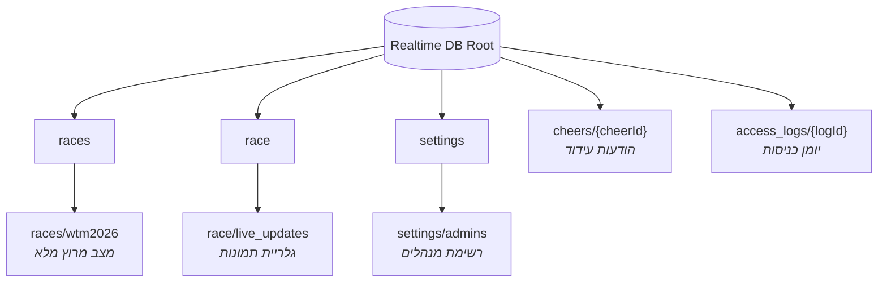
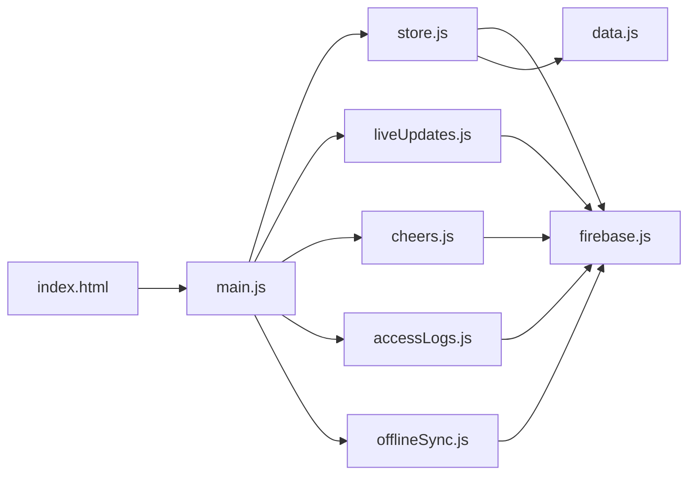

# Architecture — Source of Truth

> **MudLog / WTM2026** — מערכת ניהול מרוץ בזמן אמת.  
> עדכון אחרון: 2026-06-20

---

## סקירה כללית

| שכבה | טכנולוגיה |
|------|-----------|
| Frontend | Vanilla JS (ES Modules), HTML, CSS — ללא React/Vue |
| Build | Vite 8 |
| Backend | Firebase (פרויקט יחיד) |
| DB | **Firebase Realtime Database** (לא Firestore) |
| Auth | Firebase Auth — Google Sign-In |
| Storage | Firebase Storage |
| Hosting | Firebase Hosting (`dist/`) |
| Offline | `localStorage` + `OfflineSyncManager` (תור פעולות) |

### מבנה קבצי מקור (`src/`)

```
src/
├── main.js          # UI, ניווט, auth, delegation, render
├── store.js         # מצב מרוץ + CRUD על races/wtm2026
├── firebase.js      # אתחול Firebase + re-exports
├── data.js          # נתוני ברירת מחדל (לוח זמנים, ציוד, לוגיסטיקה)
├── liveUpdates.js   # גלריית עדכונים חיים + lightbox
├── cheers.js        # לוח עידוד
├── accessLogs.js    # יומן כניסות (Super Admin)
├── offlineSync.js   # תור offline לפעולות מרוץ
└── style.css        # עיצוב משלים ל-index.html
```

---

## Firebase Project (Environment)

| מפתח | ערך |
|------|-----|
| **Project ID** | `wtm2026-fb982` |
| **Auth Domain** | `wtm2026-fb982.firebaseapp.com` |
| **Database URL** | `https://wtm2026-fb982-default-rtdb.firebaseio.com` |
| **Storage Bucket** | `wtm2026-fb982.firebasestorage.app` |
| **Hosting URL** | `https://wtm2026-fb982.web.app` |
| **קובץ הגדרות** | `src/firebase.js` |

> **הערה:** אין הפרדת סביבות (dev/staging/prod) בקוד. פרויקט Firebase יחיד לכל הסביבות.

### Deploy

```bash
npm run build && firebase deploy
# או: npm run deploy
```

קבצי תצורה:
- `firebase.json` — Hosting + Database rules + Storage rules
- `.database.rules.json` — כללי Realtime Database
- `storage.rules` — כללי Storage

---

## Firebase Realtime Database — מפת נתיבים

> Realtime Database משתמש ב-**paths** (לא Collections כמו ב-Firestore).  
> להלן כל הנתיבים הפעילים בקוד:



### `races/wtm2026` — מצב המרוץ (Primary)

**מודול:** `store.js` · **קבוע:** `RACE_PATH = "races/wtm2026"`

| שדה | טיפוס | תיאור |
|-----|-------|-------|
| `lapLog[]` | array | היסטוריית הקפות: `{ lapNum, lapStart, lapEnd, breakEnd }` |
| `currentLapNum` | number | מספר הקפה נוכחית |
| `currentLapStart` | number\|null | timestamp התחלת הקפה |
| `currentLapEnd` | number\|null | timestamp סיום הקפה |
| `breakStart` | number\|null | timestamp תחילת הפסקה |
| `raceStarted` | boolean | האם המרוץ התחיל |
| `raceFinished` | boolean | האם המרוץ הסתיים |
| `raceFinishedAt` | number\|null | timestamp סיום מרוץ |
| `schedule[]` | array | לוח תזונה/ציוד (מ-`data.js` + עריכות) |
| `gearChecked{}` | object | צ'קליסט ציוד אישי `{ id: boolean }` |
| `logisticsChecked{}` | object | צ'קליסט לוגיסטיקה `{ index: boolean }` |
| `settings{}` | object | `targetLaps, lapPaceMin, targetLap, targetPit, durationHours, lapDist` |
| `triggers{}` | object | טריגרים סביבתיים `{ id: { id, time, title, text } }` |
| `updatedAt` | number | timestamp עדכון אחרון |

**הרשאות (`.database.rules.json`):** קריאה לכל `auth != null`; כתיבה למנהלים בלבד.

---

### `race/live_updates/{pushId}` — גלריית עדכונים חיים

**מודול:** `liveUpdates.js` · **קבוע:** `LIVE_UPDATES_PATH = "race/live_updates"`

| שדה | טיפוס | תיאור |
|-----|-------|-------|
| `imageUrl` | string | URL מ-Firebase Storage |
| `caption` | string | כיתוב אופציונלי |
| `timestamp` | number | זמן העלאה |
| `storagePath` | string | נתיב ב-Storage (למחיקה) |

**הרשאות:** תחת `race` — קריאה לכל מחובר; כתיבה למנהלים.

---

### `settings/admins/{encodedEmail}` — מנהלים

**מודול:** `main.js` · **קבוע:** `ADMINS_PATH = "settings/admins"`

| שדה | טיפוס | תיאור |
|-----|-------|-------|
| `{email.replace('.','/')}` | boolean | `true` = מנהל |

> נקודות בכתובת מייל מוחלפות בפסיק (`,`) לתאימות ל-Firebase path rules.

**הרשאות:** קריאה לכל מחובר; כתיבה ל-Super Admin בלבד (`joshelifaz@gmail.com` / UID קבוע).

---

### `cheers/{cheerId}` — לוח עידוד

**מודול:** `cheers.js` · **קבוע:** `CHEERS_PATH = "cheers"`

| שדה | טיפוס | תיאור |
|-----|-------|-------|
| `text` | string | עד 500 תווים |
| `authorName` | string | שם המחבר |
| `timestamp` | number | זמן שליחה |

**הרשאות:** קריאה לכל מחובר; יצירה לכל מחובר; מחיקה למנהלים.

---

### `access_logs/{logId}` — יומן כניסות

**מודול:** `accessLogs.js` · **קבוע:** `ACCESS_LOGS_PATH = "access_logs"`

| שדה | טיפוס | תיאור |
|-----|-------|-------|
| `uid` | string | Firebase UID |
| `name` | string | displayName |
| `email` | string | כתובת מייל |
| `timestamp` | number | זמן כניסה |

**הרשאות:** כתיבה לכל מחובר (פעם לסשן); קריאה ל-Super Admin בלבד.

---

## Firebase Storage

```
live_updates/
  └── {timestamp}.jpg    # תמונות דחוסות (max 800px, JPEG 0.8)
```

**מודול:** `liveUpdates.js` · **תיקייה:** `STORAGE_FOLDER = "live_updates"`

| כלל | ערך נוכחי (`storage.rules`) |
|-----|----------------------------|
| read | `true` (ציבורי) |
| write | `true` ⚠️ — לשקול הקשחה |

---

## Auth & תפקידים

| תפקיד | זיהוי | יכולות |
|-------|-------|--------|
| **Viewer** | כל משתמש מחובר (Google) | צפייה במרוץ, גלריה, עידוד |
| **Admin** | UID קבוע / מייל ב-`settings/admins` | עריכת מרוץ, העלאת תמונות, מחיקות |
| **Super Admin** | `joshelifaz@gmail.com` / UID `axbbTldIG9...` | ניהול מנהלים + יומן כניסות |

**PIN מקומי (לא ב-Firebase):** `ADMIN_PIN = "2626"` ב-`data.js` — לנעילת ממשק מנהל.

---

## Offline & Local Storage

| מפתח | מיקום | תוכן |
|------|-------|------|
| `WTM_QUEUE` | localStorage | תור פעולות מרוץ offline |
| `WTM_SNAPSHOT` | localStorage | snapshot אחרון של `races/wtm2026` |
| `accessLogged_{uid}` | sessionStorage | מניעת כפילות ביומן כניסות |
| `darkMode` | localStorage | העדפת מצב כהה/בהיר |

**מודול:** `offlineSync.js` — מטפל רק ב-`races/wtm2026` (לא בגלריה/עידוד).

---

## ספריות צד-שלישי

### npm Dependencies

| חבילה | גרסה | שימוש |
|-------|------|-------|
| `firebase` | ^11.10.0 | Auth, Realtime Database, Storage |
| `vite` | ^8.0.12 | dev server + build (devDependency) |

### CDN / חיצוני (ללא npm)

| משאב | מקור | שימוש |
|------|------|-------|
| Google Fonts | `fonts.googleapis.com` | Syne, Inter, Fira Code |

### APIs דפדפן (Zero-dependency)

| API | שימוש |
|-----|-------|
| Canvas API | דחיסת תמונות לפני העלאה |
| `createImageBitmap` | טעינת תמונה לדחיסה |
| `fetch` + Blob | הורדת תמונה ב-Lightbox |
| `localStorage` / `sessionStorage` | Offline + session |
| `navigator.onLine` | זיהוי מצב רשת |

---

## ארכיטקטורת Frontend



**דפוסים מרכזיים:**
- `data-target` / `data-action` — שליטה ב-DOM ללא framework
- Event delegation מרכזי ב-`initActionDelegation()` (`main.js`)
- Listeners מופעלים אחרי auth ב-`onAuthStateChanged`
- `store.subscribe()` — reactive render למצב מרוץ
